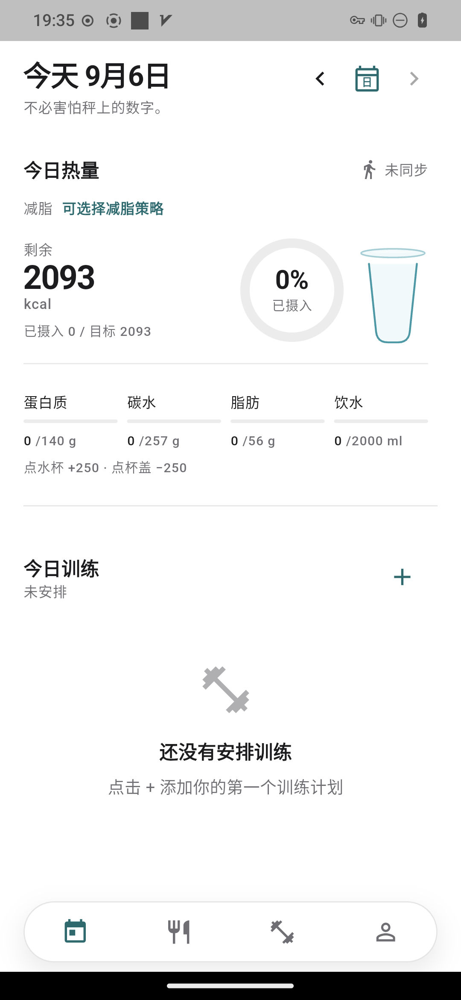
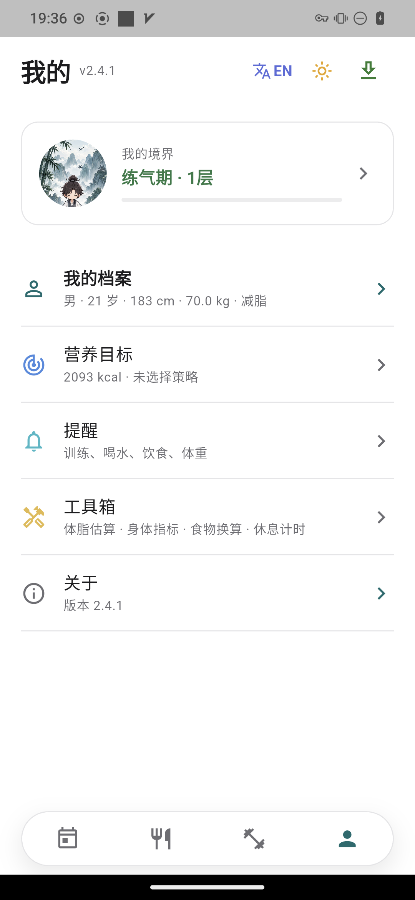
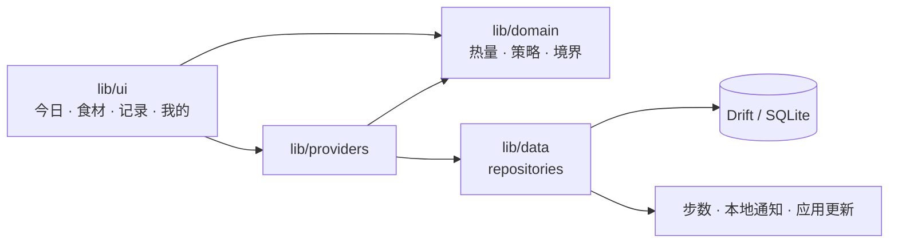

<div align="center">


<h1 id="fitness-plan">Fitness Plan</h1>

<p>
  <strong>本地健身饮食助手。热量、食材和训练都留在设备上；减脂时，缺口会变成修仙境界。</strong>
</p>

<p>An offline Flutter app for calories, food logging, and training. While you cut, the deficit advances a cultivation realm.</p>

<p>
  <a href="https://github.com/DayDaySpeed/FitnessPlan/actions/workflows/ci.yml"></a>
  <a href="https://github.com/DayDaySpeed/FitnessPlan/releases"></a>
  <a href="LICENSE"></a>
  <a href="https://github.com/DayDaySpeed/FitnessPlan/stargazers"></a>
</p>

<p>
  <a href="#features">功能</a> ·
  <a href="#preview">界面</a> ·
  <a href="#install">安装</a> ·
  <a href="#usage">运行</a> ·
  <a href="#architecture">架构</a> ·
  <a href="#english">English</a>
</p>

</div>

> 按身体数据计算每日热量和三大营养素，用内置食材库记账，并记录体重与训练。全部数据在本机 SQLite 里，不登录、不上云。

## 目录

- [功能](#features)
- [界面](#preview)
- [安装](#install)
- [运行](#usage)
- [技术栈](#stack)
- [架构](#architecture)
- [项目结构](#structure)
- [开发](#dev)
- [方向](#roadmap)
- [贡献](#contributing)
- [赞助](#donate)
- [许可证](#license)
- [English](#english)

<a id="features"></a>

## 功能

四个主页面：今日、食材、记录、我的。

<table>
<tr>
<td width="33%" align="center">

### 热量账本

Mifflin–St Jeor 计算 BMR、TDEE，以及蛋白质、碳水、脂肪。记一笔饮食，当天剩余配额自动扣减，饮水一并记下。

</td>
<td width="33%" align="center">

### 减脂策略

均衡、碳水循环、碳水递减按日给出目标。最近体重几乎不动时，会提示可能的平台期。

</td>
<td width="33%" align="center">

### 食材库

637 条中国大陆常见食材，18 个分类。每 100 克含热量、蛋白质、碳水、脂肪、酒精、纤维、钠、糖、饱和脂肪、钙。支持自定义、收藏和历史补记。

</td>
</tr>
<tr>
<td width="33%" align="center">

### 训练与身体

动作库、训练计划、组数与次数。体重曲线、体脂百分比、便签，以及 Health Connect / HealthKit 步数（安卓无权限时回退到传感器）。

</td>
<td width="33%" align="center">

### 修仙境界

减脂目标下，累计热量缺口换成练气、筑基、结丹、元婴、化神。7,700 kcal 计为 1 kg。增肌和维持的境界页仍是占位。

</td>
<td width="33%" align="center">

### 只在本地

Drift / SQLite 保存全部记录，可导出、导入备份。中英界面，浅色与石墨灰两套主题。训练、饮水、饮食、称重提醒各自独立。

</td>
</tr>
</table>

工具箱里还有美国海军围度法体脂、BMI 与腰高比、食物单位换算、千卡 / 千焦换算、计算器和休息计时器。某一天可以标成放纵餐或休息日，修仙进度会按规则跳过对应热量。

策略参数面向一般健康成年人的自助估算，不是临床处方。

<a id="preview"></a>

## 界面

<p align="center">
  
  &nbsp;&nbsp;
  
</p>

<p align="center">
  <sub>今日，以及「我的」里的境界入口。截图来自 <code>design-handoff/display/</code>，「我的」页上的版本号早于当前源码（<code>pubspec.yaml</code> 为 2.5.3）。食物分类旧图与现在的 637 条种子不一致，所以没有放。</sub>
</p>

<a id="install"></a>

## 安装

### 直接安装 Android

从 [Releases](https://github.com/DayDaySpeed/FitnessPlan/releases) 下载 APK。应用内更新也只检查这里的 Android 包。

| 文件 | 说明 |
|------|------|
| `FitnessPlan-*-android-arm64-v8a.apk` | 大多数真机用这个 |
| `FitnessPlan-*-android.apk` | 通用包，体积更大 |
| `FitnessPlan-*-android-armeabi-v7a.apk` | 较老的 32 位 ARM |
| `FitnessPlan-*-android-x86_64.apk` | 模拟器或 x86 设备 |

iOS 安装包需要在 macOS 上用 Xcode 构建，当前 Release 不提供 IPA。

### 从源码运行

需要与 `pubspec.yaml` 里 Dart SDK `^3.12.2` 匹配的 [Flutter](https://docs.flutter.dev/get-started/install)。工程带有 Android、iOS、Linux、macOS、Windows 和 Web 目标。Linux 上连接模拟器的步骤见 [docs/模拟器与运行说明.md](docs/模拟器与运行说明.md)。

```bash
git clone https://github.com/DayDaySpeed/FitnessPlan.git
cd FitnessPlan
flutter pub get
flutter run
```

指定设备：

```bash
flutter devices
flutter run -d linux
flutter build apk --debug
```

<a id="usage"></a>

## 运行

首次打开会进入引导：填写性别、年龄、身高、体重、活动量和目标（减脂 / 维持 / 增肌）。完成后，今日页给出当天热量和营养素。

日常用法：

1. 在食材页搜索或按分类选食物，记入早、午、晚或加餐。
2. 在记录页写下体重、训练计划和组数，或写一条便签。
3. 在「我的」里查看营养目标、提醒、工具箱；减脂时进入境界页看进度。

本机打正式 Android 包（需先配置签名，`key.properties` 和 `*.jks` 已忽略，不要提交）：

```bash
./tool/create_release_keystore.sh   # 仅首次
./tool/build_release_apk.sh         # analyze、test，产物到 dist/
```

签名示例见 [android/key.properties.example](android/key.properties.example)。在 Mac 上可以：

```bash
flutter build ipa --release
```

<a id="stack"></a>

## 技术栈

<p align="center">
  
</p>

<p align="center">
  
  
  
  
</p>

| 依赖 | 版本 | 用途 |
|------|------|------|
| Flutter / Dart | SDK `^3.12.2` | UI。正文字体是霞鹜文楷与思源黑体 |
| flutter_riverpod | `^3.3.2` | 状态 |
| go_router | `^17.3.0` | 路由与底部四个分页 |
| drift | `^2.34.2` | 本地 SQLite |
| fl_chart | `^1.2.0` | 体重等图表 |
| health | `^13.3.1` | Health Connect / HealthKit 步数 |
| flutter_local_notifications | `^22.0.1` | 本地提醒 |
| shared_preferences | `^2.5.5` | 主题、语言等轻量配置 |

底部导航和大部分页面使用项目内的水墨图标（`assets/ink/`）。

<a id="architecture"></a>

## 架构

计算与界面分开。热量、减脂策略、平台期和修仙进度都在 `lib/domain/`，不依赖 Flutter。页面通过 Riverpod 读写仓库，仓库再落到 Drift 或系统能力。



安卓上的应用更新只在启动和回到前台时静默查询 GitHub Release。桌面和 Web 没有健康存储，步数同步会标成不支持。

<a id="structure"></a>

## 项目结构

```text
FitnessPlan/
├── lib/
│   ├── domain/          # 热量、策略、境界、体脂等纯计算
│   ├── data/            # Drift 表、仓库、步数与提醒桥接
│   ├── providers/       # Riverpod
│   ├── ui/              # 今日、食材、记录、策略、工具、境界、主题
│   ├── features/        # 开屏动画
│   └── l10n/            # 中英 ARB 与生成代码
├── assets/
│   ├── food_seed.json   # 637 条食材种子
│   ├── branding/        # Logo
│   ├── cultivation/     # 境界原画
│   ├── ink/             # 水墨图标
│   └── fonts/
├── android/ ios/ linux/ macos/ windows/ web/
├── test/                # 算法、仓库、widget 测试
├── tool/                # 发布脚本；旧的食材合并脚本仅作参考
├── docs/                # 运行说明、赞助
├── design-handoff/      # 设计稿，不打进安装包
└── .github/workflows/ci.yml
```

<a id="dev"></a>

## 开发

改 `lib/data` 里的表之后：

```bash
dart run build_runner build
```

改 [lib/l10n/app_zh.arb](lib/l10n/app_zh.arb) 或模板 [lib/l10n/app_en.arb](lib/l10n/app_en.arb) 之后：

```bash
flutter gen-l10n
```

`flutter pub get` 和 `flutter run` 也会触发生成。配置在 [l10n.yaml](l10n.yaml)。

食材种子是 [assets/food_seed.json](assets/food_seed.json)。改完要把 [lib/data/repositories/food_repository.dart](lib/data/repositories/food_repository.dart) 里的 `kFoodSeedVersion` 加一（当前 `13`），已安装的设备才会重新同步。`tool/build_food_seed.py` 已废弃，只留作历史参考。

只看开屏、不进首页：

```bash
flutter run --dart-define=LOADING_LAB=true
```

<a id="roadmap"></a>

## 方向

代码里已经写明、但还没做完的只有境界体系的另外两条线：

- [x] 减脂修仙：练气 → 筑基 → 结丹 → 元婴 → 化神
- [x] 本地饮食、训练、身体记录、提醒，以及 Android Release
- [ ] 增肌、维持的境界玩法（入口在，内容仍是占位页）

<a id="contributing"></a>

## 贡献

提交前在本地跑与 CI 相同的检查。CI 在推送到 `main` / `master` 以及每个 PR 上执行 [`.github/workflows/ci.yml`](.github/workflows/ci.yml)。

```bash
flutter analyze --no-fatal-infos
flutter test
```

风格遵循 `flutter_lints`，规则见 [analysis_options.yaml](analysis_options.yaml)。版权材料用的截图测试默认跳过（见 [dart_test.yaml](dart_test.yaml)）。

<a id="donate"></a>

## 赞助

如果这个项目有用，可以 [用支付宝赞助](docs/donate.md)。

<a id="license"></a>

## 许可证

个人、教育和其它非商业用途免费。商业使用需要另行授权，联系 goingjiang@gmail.com。详见 [LICENSE](LICENSE)。

---

<a id="english"></a>

## English

[← 中文](#fitness-plan)

Fully offline fitness and nutrition app. It turns body stats into a daily calorie and macro budget, ships a Mainland China food database, and stores meals, weight, and workouts on device. No account, no cloud.

While the goal is fat loss, cumulative deficit is mapped onto a cultivation realm: Qi Refining, Foundation, Core Formation, Nascent Soul, Divine Transformation. 7,700 kcal counts as 1 kg. Bulk and maintain still open a placeholder realm screen.

### Features

- Mifflin–St Jeor: BMR, TDEE, protein / carbs / fat, plus water
- Fat-loss strategies: balanced, carb cycling, carb tapering, with plateau hints
- 637 common Mainland China foods in 18 categories, 10 nutrients per 100 g, custom foods, favorites, and backfill
- Exercise library, training plans, set logging, weight chart, body-fat %, notes
- Steps via Health Connect / HealthKit, with an Android sensor fallback
- Reminders for workout, water, meals, and weigh-in
- Toolbox: Navy body-fat estimate, BMI, unit conversion, kcal/kJ, calculator, rest timer
- Chinese and English UI, light and graphite themes
- JSON backup import / export, and in-app Android updates from GitHub Releases

Strategy numbers are self-service estimates for generally healthy adults, not a clinical prescription.

### Install and run

Download an Android APK from [Releases](https://github.com/DayDaySpeed/FitnessPlan/releases). `FitnessPlan-*-android-arm64-v8a.apk` fits most phones.

```bash
git clone https://github.com/DayDaySpeed/FitnessPlan.git
cd FitnessPlan
flutter pub get
flutter run
```

Dart SDK constraint: `^3.12.2`. After the first launch, enter sex, age, height, weight, activity, and a goal (cut / maintain / bulk).

```bash
flutter analyze --no-fatal-infos
flutter test
./tool/build_release_apk.sh    # signed release APKs → dist/
```

iOS builds need macOS and Xcode (`flutter build ipa --release`). This repo's releases are Android-only.

Bump `kFoodSeedVersion` (currently `13`) after editing `assets/food_seed.json`. Regenerate Drift with `dart run build_runner build`.

### License

Free for personal and other non-commercial use. Commercial use needs a paid license: goingjiang@gmail.com. See [LICENSE](LICENSE).

[Donate via Alipay](docs/donate.md).
