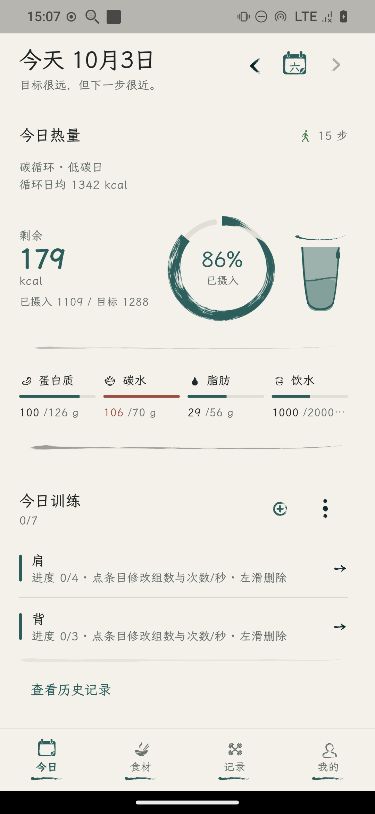
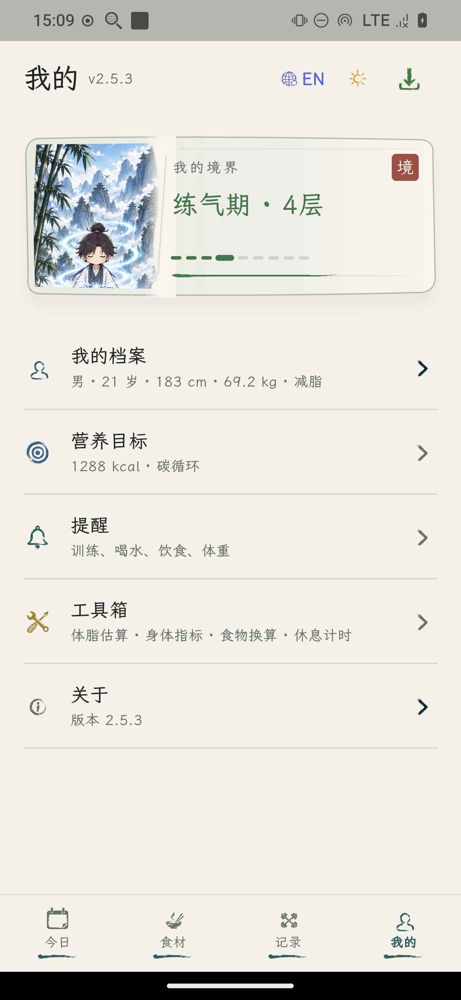
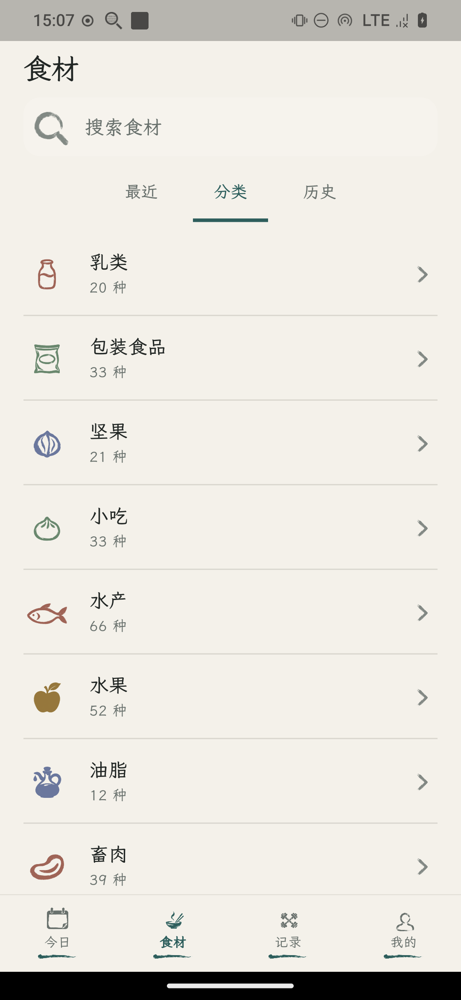
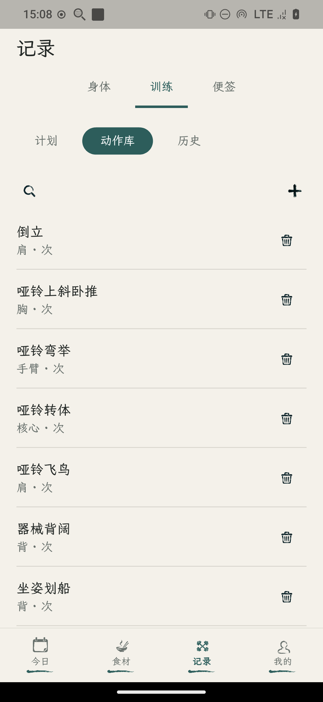
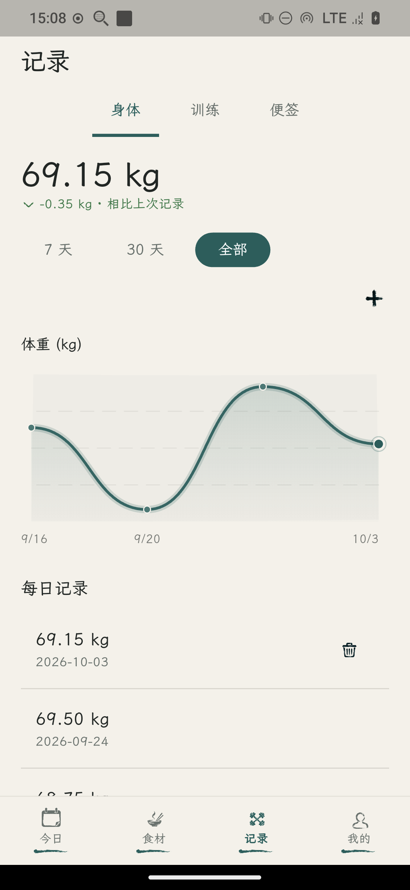
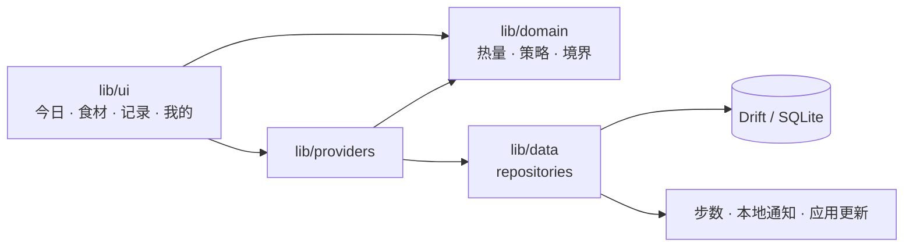

<div align="center">


<h1>Fitness Plan</h1>

<p>
  <strong>Your offline fitness & nutrition companion.</strong>
</p>

<p>
  本地记录饮食、训练与身体数据。<br>
  减脂时，把热量缺口变成修仙境界。
</p>

<p>
  <a href="./README.md">中文</a> ·
  <a href="./README_EN.md">English</a>
</p>

<p>
  <a href="https://github.com/DayDaySpeed/FitnessPlan/actions/workflows/ci.yml"></a>
  <a href="https://github.com/DayDaySpeed/FitnessPlan/releases"></a>
  <a href="LICENSE"></a>
</p>

<br>

<p>
  
  &nbsp;&nbsp;
  
</p>

</div>

## 为什么是 Fitness Plan

健身记录应该留在你自己的设备上。

它按身体数据算出每天的热量和营养素，用一份本地食材库记账，并把体重和训练一起留下。没有账号，也没有云端。

## ✦ 它做什么

### 饮食

Mifflin–St Jeor 算出基础代谢、每日消耗，以及蛋白质、碳水和脂肪。内置 637 条中国大陆常见食材，18 个分类，每 100 克 10 项营养素。记一笔，当天剩余配额就减下去，饮水也记在同一天。

<p align="center">
  
</p>

### 训练

动作库、训练计划、组数和次数。今天练什么、做了几组，都写在本机。

<p align="center">
  
</p>

### 身体

体重曲线、体脂百分比，以及最近几次体重几乎不动时的平台期提示。步数来自 Health Connect / HealthKit；安卓没有权限时，回退到手机传感器。

<p align="center">
  
</p>

### 修仙

减脂时，累计的热量缺口会变成境界，而不只是一行越来越小的数字。

## ⚔️ 修仙

减脂不该只剩下表格。

<p align="center">
  <strong>7,700 kcal → 1 kg</strong>
  <br><br>
  练气<br>
  ↓<br>
  筑基<br>
  ↓<br>
  结丹<br>
  ↓<br>
  元婴<br>
  ↓<br>
  化神
</p>

这套境界只在减脂目标下完整可用。增肌和维持能打开入口，里面仍是占位。某一天可以标成放纵餐或休息日，对应的热量不计入修行。

均衡、碳水循环和碳水递减会按日给出目标。这些数字是给一般健康成年人的自助估算，不是临床处方。

## 🔒 数据留在本地

<div align="center">

Drift → SQLite

不登录 · 不上云 · 不追踪

</div>

饮食、体重、训练和偏好都在这台设备上，可以导出，也可以再导入。训练、饮水、饮食和称重可以各自提醒。界面有中文和英文，以及浅色、石墨灰两套主题。

## 🚀 开始使用

### Android

从 [Releases](https://github.com/DayDaySpeed/FitnessPlan/releases) 下载 APK。大多数真机用 `FitnessPlan-*-android-arm64-v8a.apk`。

### 源码

需要与 `pubspec.yaml` 里 Dart SDK `^3.12.2` 匹配的 [Flutter](https://docs.flutter.dev/get-started/install)。

```bash
git clone https://github.com/DayDaySpeed/FitnessPlan.git
cd FitnessPlan
flutter pub get
flutter run
```

第一次打开，填写性别、年龄、身高、体重、活动量，以及目标：减脂、维持或增肌。

## 架构

热量、减脂策略、平台期和修仙进度在 `lib/domain/`，不依赖 Flutter。页面经 Riverpod 读写仓库，仓库再落到数据库或系统能力。



安卓会在启动和回到前台时静默查看 GitHub Release。桌面和 Web 没有健康存储，步数会标成不支持。

## 技术栈

- Flutter / Dart `^3.12.2`。正文字体是霞鹜文楷与思源黑体
- flutter_riverpod `^3.3.2`
- go_router `^17.3.0`
- drift `^2.34.2`，本地 SQLite
- health `^13.3.1`，步数
- flutter_local_notifications `^22.0.1`
- fl_chart `^1.2.0`，体重图表

底部导航和大部分页面使用 `assets/ink/` 里的水墨图标。

## 项目结构

```text
FitnessPlan/
├── lib/
│   ├── domain/          # 热量、策略、境界
│   ├── data/            # Drift、仓库、步数与提醒
│   ├── providers/
│   ├── ui/              # 今日、食材、记录、我的
│   └── l10n/
├── assets/
│   ├── food_seed.json   # 637 条食材
│   ├── branding/
│   ├── cultivation/     # 境界原画
│   └── ink/
├── test/
├── tool/                # 发布脚本
└── android/ ios/ linux/ macos/ windows/ web/
```

## 开发

改表结构之后：

```bash
dart run build_runner build
```

改 [lib/l10n/app_zh.arb](lib/l10n/app_zh.arb) 或模板 [lib/l10n/app_en.arb](lib/l10n/app_en.arb) 之后执行 `flutter gen-l10n`。`flutter pub get` 也会生成。

改 [assets/food_seed.json](assets/food_seed.json) 后，把 [lib/data/repositories/food_repository.dart](lib/data/repositories/food_repository.dart) 里的 `kFoodSeedVersion` 加一（当前 `13`），已安装的设备才会重新同步。

提交前：

```bash
flutter analyze --no-fatal-infos
flutter test
```

正式 Android 包（需签名，不要提交 `key.properties` 或 `*.jks`）：

```bash
./tool/build_release_apk.sh
```

示例见 [android/key.properties.example](android/key.properties.example)。iOS 需要 macOS 与 Xcode：

```bash
flutter build ipa --release
```

当前 Release 只有 Android APK。Linux 模拟器见 [docs/android-emulator.md](docs/android-emulator.md)。

## 方向

- [x] 减脂修仙：练气 → 筑基 → 结丹 → 元婴 → 化神
- [x] 本地饮食、训练、身体记录，以及 Android Release
- [ ] 增肌、维持的境界玩法（入口在，内容仍是占位）

## 贡献

与 CI 相同：`flutter analyze --no-fatal-infos` 和 `flutter test`。CI 配置在 [`.github/workflows/ci.yml`](.github/workflows/ci.yml)，风格见 [analysis_options.yaml](analysis_options.yaml)。

## 赞助

如果这个项目有用，可以 [用支付宝赞助](docs/donate.md)。

## 许可证

个人、教育和其它非商业用途免费。商业使用需要另行授权，联系 goingjiang@gmail.com。详见 [LICENSE](LICENSE)。

<div align="center">

Made with Flutter

</div>
