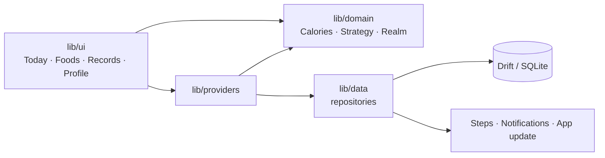

<div align="center">


<h1>Fitness Plan</h1>

<p>
  <strong>Your offline fitness & nutrition companion.</strong>
</p>

<p>
  Meals, training, and body data stay on this device.<br>
  While you cut, a calorie deficit becomes a cultivation realm.
</p>

<p>
  <a href="./README.md">中文</a> ·
  <a href="./README_EN.md">English</a>
</p>

<p>
  <a href="https://github.com/DayDaySpeed/FitnessPlan/actions/workflows/ci.yml"></a>
  <a href="https://github.com/DayDaySpeed/FitnessPlan/releases"></a>
  <a href="LICENSE"></a>
</p>

<br>

<p>
  
  &nbsp;&nbsp;
  
</p>

<p>
  <sub>The version label on the profile screenshot is older than the current source, 2.5.3.</sub>
</p>

</div>

## Why Fitness Plan

Your fitness log should stay on your own device.

It turns body stats into a daily calorie and macro budget, logs meals from a local food database, and keeps weight and training beside them. No account. No cloud.

## ✦ What it does

### Eat

Mifflin–St Jeor produces BMR, TDEE, and protein, carbs, and fat. The built-in library has 637 common Mainland China foods in 18 categories, with 10 nutrients per 100 g. Logging a meal spends today's budget. Water is recorded on the same day.

### Train

An exercise library, training plans, and sets. What you do today stays on the device.

### Progress

A weight chart, body-fat percentage, and a hint when recent weigh-ins barely move. Steps come from Health Connect or HealthKit. On Android, a missing permission falls back to the phone sensor.

### Cultivate

While cutting, the running calorie deficit becomes a realm, not only a shrinking number.

## ⚔️ Cultivation

Cutting should not feel like a spreadsheet.

<p align="center">
  <strong>7,700 kcal → 1 kg</strong>
  <br><br>
  Qi Refining<br>
  ↓<br>
  Foundation<br>
  ↓<br>
  Core Formation<br>
  ↓<br>
  Nascent Soul<br>
  ↓<br>
  Divine Transformation
</p>

This path is complete only for the cut goal. Bulk and maintain can open the screen; the content is still a placeholder. A day marked as a cheat meal or a rest day leaves that day's calories out of cultivation.

Balanced days, carb cycling, and carb tapering each set a target for the day. The numbers are self-service estimates for generally healthy adults, not a clinical prescription.

## 🔒 Your data stays yours

<div align="center">

Drift → SQLite

No account · No cloud · No tracking

</div>

Meals, weight, workouts, and preferences stay on the device. You can export a backup and import it again. Workout, water, meal, and weigh-in reminders are each their own. The interface is Chinese and English, in a light theme and a graphite theme.

## 🚀 Get started

### Android

Download an APK from [Releases](https://github.com/DayDaySpeed/FitnessPlan/releases). Most phones want `FitnessPlan-*-android-arm64-v8a.apk`.

### Source

You need [Flutter](https://docs.flutter.dev/get-started/install) matching the Dart SDK constraint `^3.12.2` in `pubspec.yaml`.

```bash
git clone https://github.com/DayDaySpeed/FitnessPlan.git
cd FitnessPlan
flutter pub get
flutter run
```

On first launch, enter sex, age, height, weight, activity, and a goal: cut, maintain, or bulk.

## Architecture

Calorie math, fat-loss strategies, plateau detection, and cultivation progress live in `lib/domain/`, with no Flutter imports. Screens talk to repositories through Riverpod. Repositories write to the database or to system services.



Android silently checks GitHub Releases on launch and when the app returns to the foreground. Desktop and web have no health store, so step sync is marked unsupported.

## Tech stack

- Flutter / Dart `^3.12.2`. Body text uses LXGW WenKai and Noto Sans SC
- flutter_riverpod `^3.3.2`
- go_router `^17.3.0`
- drift `^2.34.2`, on-device SQLite
- health `^13.3.1`, steps
- flutter_local_notifications `^22.0.1`
- fl_chart `^1.2.0`, weight charts

The bottom navigation and most screens use the ink icons in `assets/ink/`.

## Project structure

```text
FitnessPlan/
├── lib/
│   ├── domain/          # calories, strategy, cultivation
│   ├── data/            # Drift, repositories, steps, reminders
│   ├── providers/
│   ├── ui/              # today, foods, records, profile
│   └── l10n/
├── assets/
│   ├── food_seed.json   # 637 foods
│   ├── branding/
│   ├── cultivation/     # realm art
│   └── ink/
├── test/
├── tool/                # release scripts
└── android/ ios/ linux/ macos/ windows/ web/
```

## Development

After changing a table:

```bash
dart run build_runner build
```

After editing [lib/l10n/app_zh.arb](lib/l10n/app_zh.arb) or the template [lib/l10n/app_en.arb](lib/l10n/app_en.arb), run `flutter gen-l10n`. `flutter pub get` generates as well.

After editing [assets/food_seed.json](assets/food_seed.json), bump `kFoodSeedVersion` (currently `13`) in [lib/data/repositories/food_repository.dart](lib/data/repositories/food_repository.dart) so existing installs re-sync.

Before a pull request:

```bash
flutter analyze --no-fatal-infos
flutter test
```

A signed Android release (do not commit `key.properties` or `*.jks`):

```bash
./tool/build_release_apk.sh
```

See [android/key.properties.example](android/key.properties.example). iOS needs macOS and Xcode:

```bash
flutter build ipa --release
```

Releases here are Android APKs only. Linux emulator notes are in [docs/模拟器与运行说明.md](docs/模拟器与运行说明.md) (Chinese).

## Roadmap

- [x] Cut cultivation: Qi Refining → Foundation → Core Formation → Nascent Soul → Divine Transformation
- [x] Local meals, training, body logs, and Android releases
- [ ] Bulk and maintain cultivation (the entrance exists; the page is still a placeholder)

## Contributing

Match CI: `flutter analyze --no-fatal-infos` and `flutter test`. The workflow is [`.github/workflows/ci.yml`](.github/workflows/ci.yml). Style is in [analysis_options.yaml](analysis_options.yaml).

## Donate

If this project helps, you can [donate via Alipay](docs/donate.md).

## License

Free for personal, educational, and other non-commercial use. Commercial use needs a separate license: goingjiang@gmail.com. See [LICENSE](LICENSE).

<div align="center">

Made with Flutter

</div>
